# Manuale Utente — Ruggine

## Indice
1. [Introduzione](#1-introduzione)
2. [Requisiti di sistema](#2-requisiti-di-sistema)
3. [Installazione e Configurazione](#3-installazione-e-configurazione)
4. [Panoramica dell'interfaccia utente](#4-panoramica-dellinterfaccia-utente)
5. [Come utilizzare la Chat](#5-come-utilizzare-la-chat)
6. [Sicurezza e Privacy](#6-sicurezza-e-privacy)

---

## 1. Introduzione

### Cos'è l'applicazione
Ruggine è un'applicazione di messaggistica in tempo reale che combina API REST e WebSocket per fornire chat private e di gruppo, inviti, gestione ruoli e notifiche. Il backend è scritto in Rust (Axum + sqlx) e il client è React/TypeScript (Vite). Il client viene fornito tramite un'applicazione che utilizza il framework Tauri.

### A chi è destinata
L'app è pensata per utenti finali che desiderano comunicare in tempo reale in contesti di team o privati. È adatta ad utenti non tecnici e a sviluppatori che vogliano estenderla o integrarla.

### Funzionalità principali
- Messaggistica in tempo reale via WebSocket
- Chat private e di gruppo
- Inviti e gestione membership (OWNER, ADMIN, MEMBER)
- Storico messaggi persistito su MySQL
- Notifiche in‑app

---

## 2. Requisiti di sistema

### Dispositivi supportati
- Desktop e laptop (Windows, Linux)
- App desktop (distribuita tramite Tauri): Windows x86_64, Linux

### Requisiti di rete/connessione
- Connessione internet stabile tramite HTTP/HTTPS
- Banda e latenza: connessioni più veloci e latenza bassa migliorano l'esperienza in tempo reale

---

## 3. Installazione e Configurazione

### Come creare un account

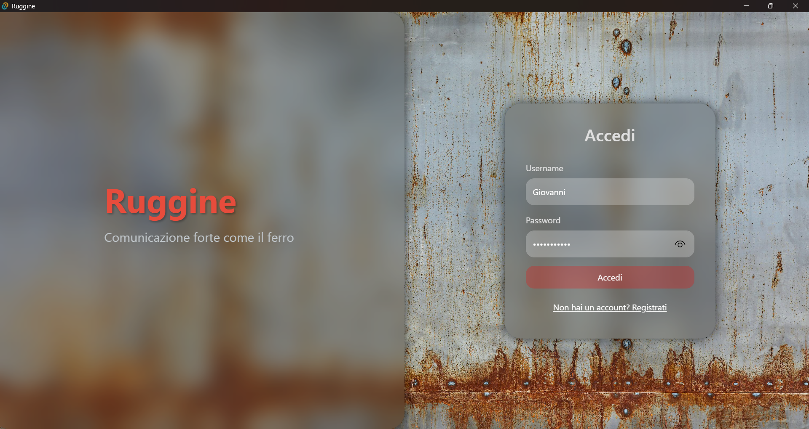

1. Avvia il client desktop.
2. Clicca su `Non hai un account? Registrati`.

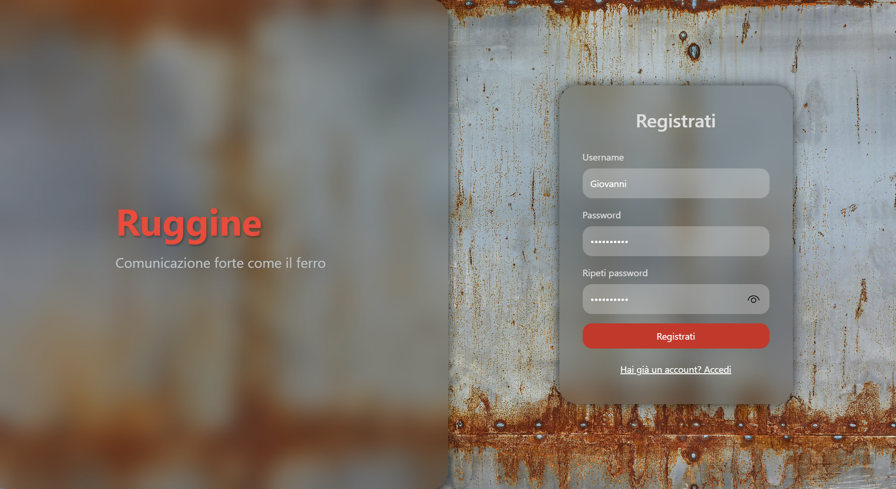

3. Inserisci un nome utente e una password conforme alla policy (min. 8 caratteri, e deve contenere almeno: una lettera minuscola e una maiuscola, un numero e un carattere speciale).
4. Clicca su `Registrati`.
5. In caso di successo sarai reindirizzato alla schermata principale.

### Procedura di login

1. Apri la pagina di login.
2. Inserisci username e password.
3. Clicca su `Accedi`.
4. Se le credenziali sono corrette, l'app ti dirigerà alla schermata principale.

---

## 4. Panoramica dell'interfaccia utente

### Elementi principali

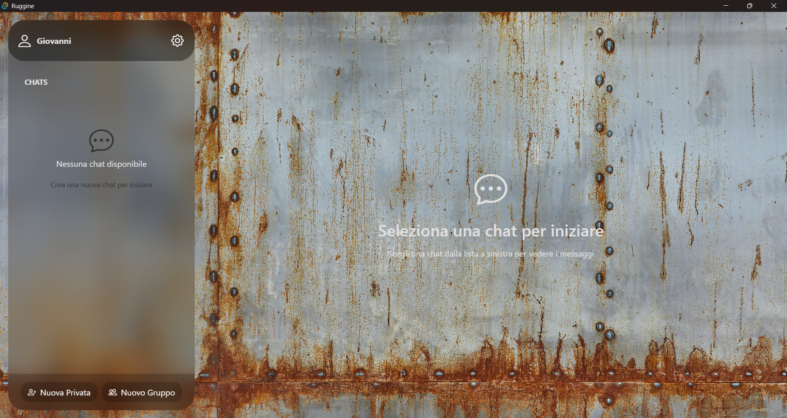

- **Sidebar (sinistra)**: informazioni utente, elenco chat e pulsanti `Nuova Privata` e `Nuovo Gruppo`.
- **Area centrale**: conversazione attiva con elenco messaggi.
- **Info chat**: cliccando sull'icona info in alto a destra si aprono i dettagli della chat.

---

## 5. Come utilizzare la Chat

### Creare una chat privata

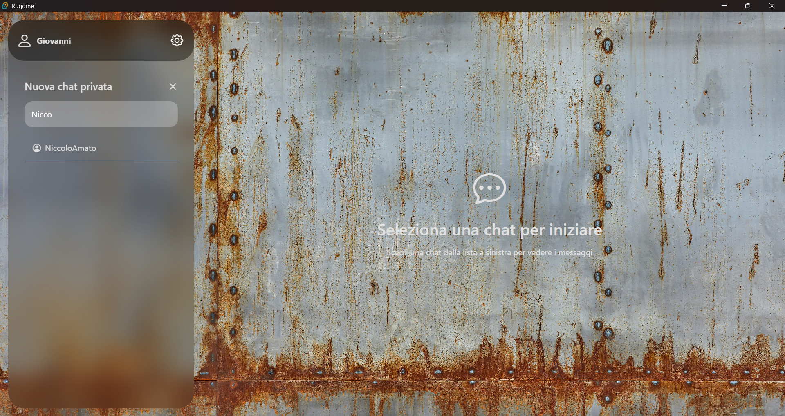

1. Clicca su `Nuova Privata` nella sidebar.
2. Inserisci l'username dell'utente con cui vuoi chattare.
3. Clicca sul nome dell'utente con cui vuoi chattare.
4. La chat verrà creata e apparirà nella lista.

### Creare un gruppo

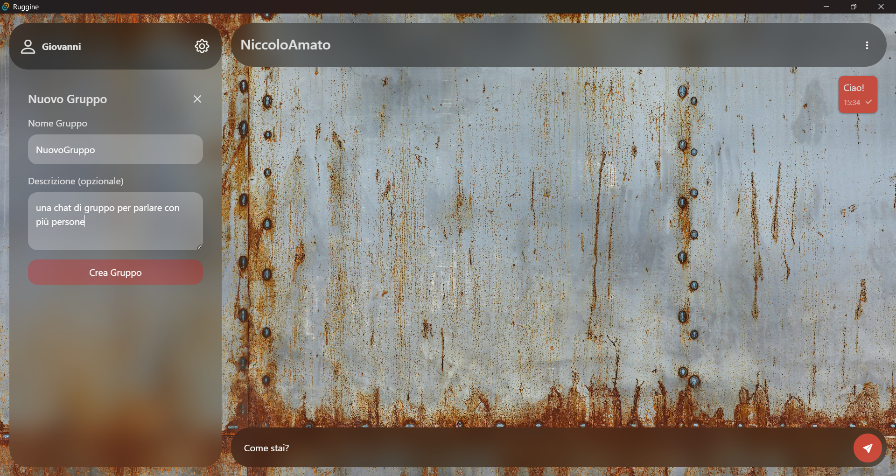

1. Clicca su `Nuovo Gruppo` nella sidebar.
2. Inserisci il titolo del gruppo.
3. Inserisci una descrizione (facoltativa).
4. Clicca su `Crea Gruppo`.
5. Il gruppo verrà creato e potrai iniziare ad aggiungere membri.

### Inviare messaggi

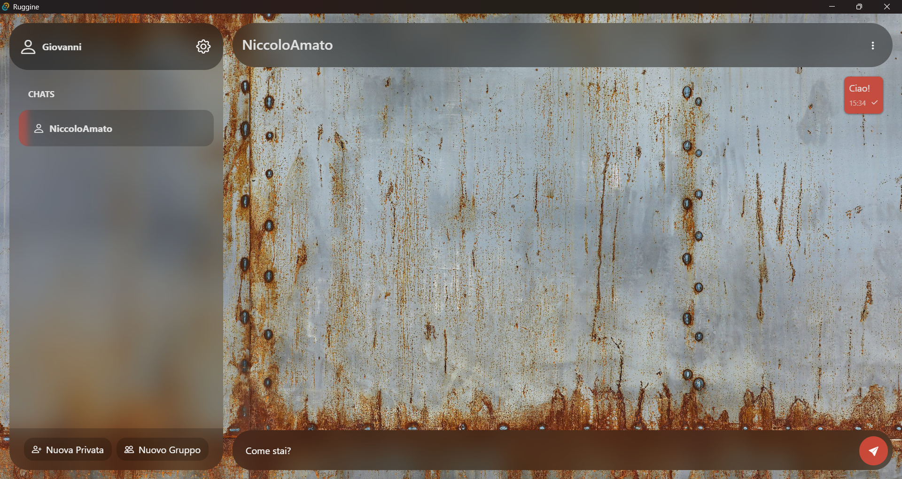

1. Seleziona la chat dalla lista nella sidebar.
2. Digita il messaggio nel campo di testo in basso.
3. Premi `Invio` o il tasto in basso a destra per inviare il messaggio.
4. I messaggi vengono recapitati in tempo reale agli altri utenti connessi.

### Invitare membri in un gruppo (solo proprietario o amministratore)

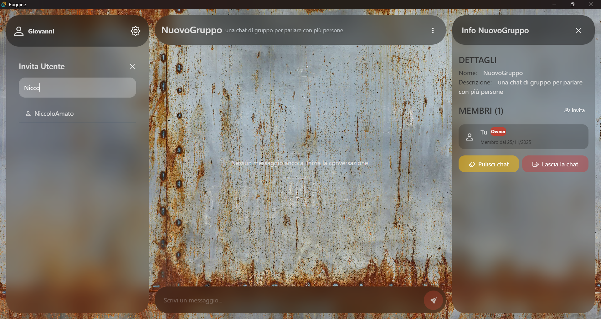

1. Apri un gruppo di cui sei proprietario o amministratore.
2. Clicca sull'icona info in alto a destra.
3. Clicca su `Invita`.

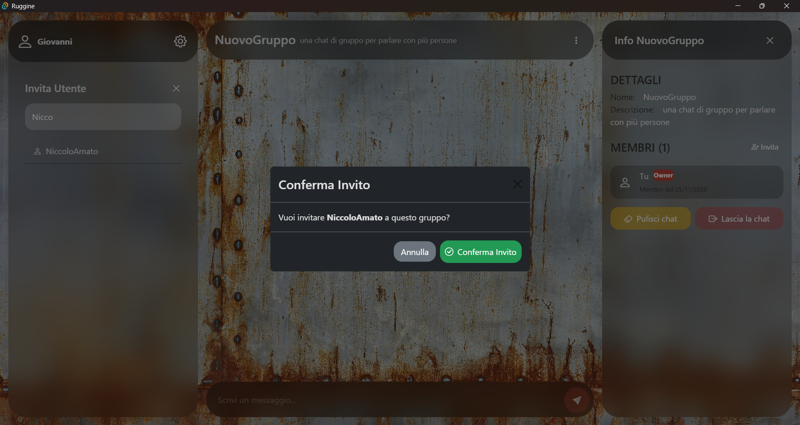

4. Inserisci l'username dell'utente da invitare.
5. Clicca su `Conferma Invito` nel popup.
6. L'utente riceverà una notifica e potrà accettare o rifiutare l'invito.

### Ricevere e accettare inviti

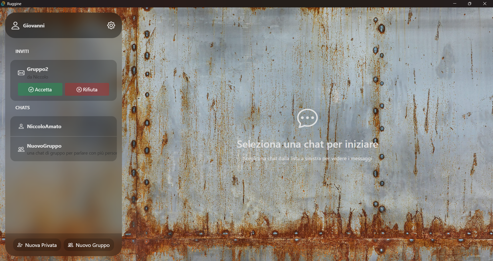

1. Quando ricevi un invito, apparirà una notifica nella sidebar.
2. Clicca su `Accetta` per unirti al gruppo o `Rifiuta` per declinare.

### Gestire i ruoli (proprietario o amministratore)

Se sei proprietario o amministratore di un gruppo, puoi modificare i ruoli dei membri:

- **Proprietario**: può promuovere membri ad amministratori o trasferire il ruolo di proprietario ad un utente amministratore
- **Amministratore**: può solo modificare il ruolo dei membri semplici

1. Apri le info del gruppo.
2. Clicca su `Promuovi` o `Retrocedi` accanto al nome del membro.

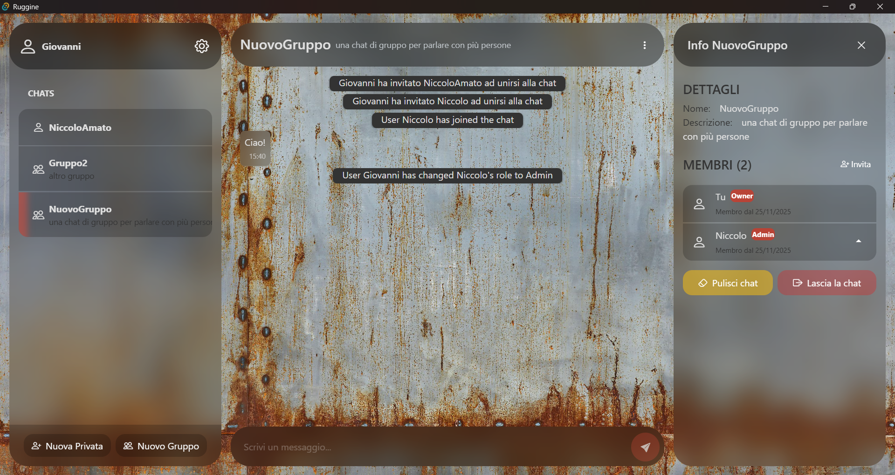

3. Conferma la modifica del ruolo.

### Trasferire la proprietà (solo proprietario)

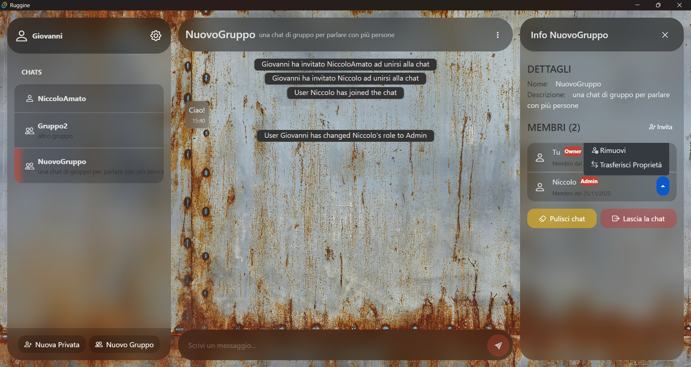

1. Apri le info del gruppo.
2. Clicca su un utente del gruppo
3. Clicca su `Trasferisci Proprietà`.

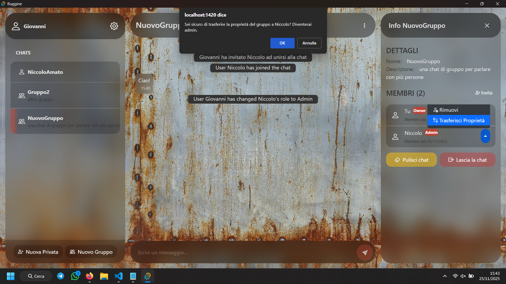

3. Seleziona il nuovo proprietario dalla lista dei membri.

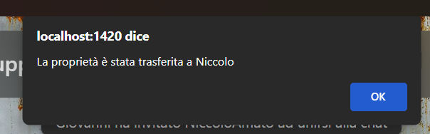

4. Conferma il trasferimento.
5. Il nuovo proprietario avrà il pieno controllo del gruppo.

### Uscire da un gruppo

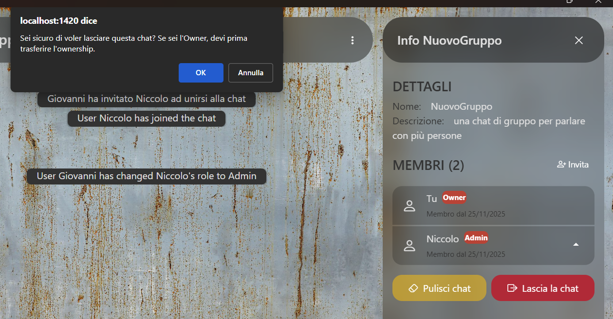

1. Apri le info del gruppo.
2. Clicca su `Esci dal Gruppo`.
3. Conferma l'uscita.
4. Non potrai più visualizzare i messaggi del gruppo.

**Nota**: se sei il proprietario e l'unico membro, il gruppo verrà eliminato completamente. Altrimenti, se sei il proprietario, prima di poter uscire dal gruppo dovrai trasferire l'ownership ad un altro utente amministratore.

### Pulire la cronologia chat

Qualsiasi membro può pulire la propria cronologia dei messaggi:

1. Apri le info della chat.
2. Clicca su `Pulisci Chat`.
3. Conferma l'azione.
4. I messaggi precedenti non saranno più visibili per te, ma rimarranno per gli altri membri.

**Nota**: quando tutti i membri hanno pulito i messaggi fino a una certa data, quei messaggi vengono eliminati definitivamente dal database.

### Rimuovere membri (solo proprietario o amministratore)

Se sei proprietario o amministratore, puoi rimuovere membri dal gruppo:

1. Apri le info del gruppo.
2. Clicca su `Rimuovi` accanto al nome del membro.
3. Conferma la rimozione.

**Limitazioni**:
- Non puoi rimuovere il proprietario del gruppo
- Il membro rimosso riceverà una notifica e la chat verrà rimossa dalla sua lista

### Eliminare il proprio account

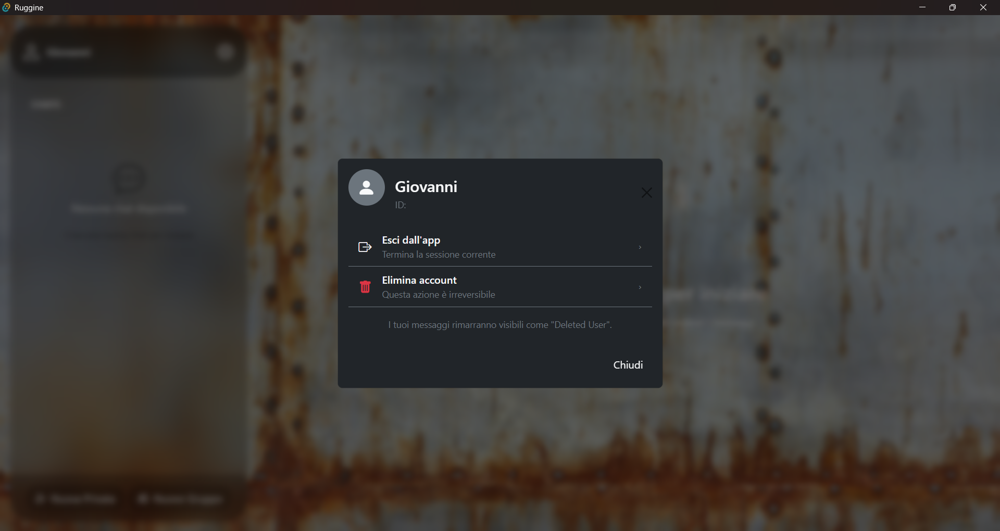

1. Clicca sul tuo profilo nella sidebar.
2. Clicca su `Elimina Account`.

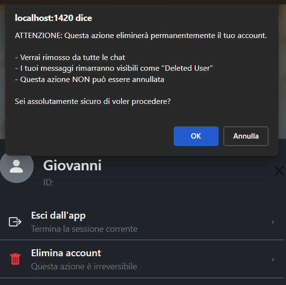

3. Conferma l'eliminazione.
4. Il tuo account e tutti i dati associati verranno eliminati in modo permanente.

---

## 6. Sicurezza e Privacy

### Autenticazione
- Le password vengono hashate con `bcrypt` prima di essere salvate nel database.

### Conservazione dei dati
- I messaggi sono salvati in modo permanente nel database MySQL.
- L'eliminazione dell'account rimuove tutti i dati personali.

### Consigli per la sicurezza
- Usa password forti e uniche.
- Non condividere il tuo account con altri.
- Fai logout quando usi dispositivi condivisi.

