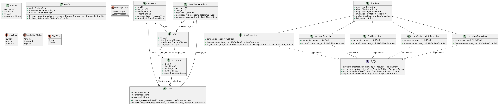

# Documentazione Ufficiale – **Ruggine: App di Chat Testuale**# Documentazione Ufficiale – **Ruggine: App di Chat Testuale**


## 1. Introduzione## 1. Introduzione

**Ruggine** è un'applicazione client/server sviluppata in **Rust** per la gestione di chat testuali.  **Ruggine** è un’applicazione client/server sviluppata in **Rust** per la gestione di chat testuali.  

L'obiettivo è fornire un sistema efficiente, sicuro e multi-piattaforma che consenta comunicazioni sia private che di gruppo.L’obiettivo è fornire un sistema efficiente, sicuro e multi–piattaforma che consenta comunicazioni sia private che di gruppo.


---## 2. Obiettivi del Progetto

- Fornire un sistema di **messaggistica testuale** robusto e scalabile.

## 2. Stato Corrente dell'Implementazione (Aggiornato: 5 Ottobre 2025)- Permettere la creazione di **gruppi di utenti**, accessibili solo tramite invito.

- Garantire **portabilità** su almeno due piattaforme tra Windows, Linux, MacOS, Android, ChromeOS e iOS.

### 2.1 Server Backend ✅ (80% Completato)- Ottimizzare **prestazioni** (CPU e dimensione binario).

- Implementare un sistema di **logging** periodico delle risorse utilizzate dal server.

#### ✅ **Completamente Implementato:**

- **Architettura**: REST API + WebSocket con Axum framework (v0.8.4)## 4. Requisiti

- **Database**: MySQL con SQLx (compile-time checked queries)

- **Schema DB Completo**: ### 4.1 Requisiti Funzionali (Stato di implementazione)

  - Tabelle: `users`, `chats`, `messages`, `userchatmetadata`, `invitations`- **Gestione utenti**: [x] Struttura implementata, [~] Login parziale, [ ] Altri endpoint da completare

  - Tipi ENUM nativi: `USERMESSAGE/SYSTEMMESSAGE`, `OWNER/ADMIN/STANDARD`, `PENDING/ACCEPTED/REJECTED`, `GROUP/PRIVATE`- **Chat unificate**: [x] Modello unificato Chat (Group/Private), [ ] Logica di business da implementare  

  - Tipi TIMESTAMP per gestione date UTC- **Messaggi**: [x] Modello implementato, [ ] Invio/ricezione da implementare

  - Foreign keys con CASCADE e SET NULL appropriati- **Inviti**: [x] Modello implementato, [ ] Logica di business da implementare

- **Autenticazione**: JWT Bearer Token completo- **Logging**: [ ] Non implementato

  - Encoding/Decoding con `jsonwebtoken`

  - Middleware di autenticazione funzionante### 4.2 Requisiti Non Funzionali

  - Password hashing con `bcrypt`- Portabilità (almeno 2 piattaforme).

- **Repository Layer Completo**: Pattern CRUD per tutti i modelli- Efficienza massima in CPU e memoria.

  - `UserRepository` - Gestione utenti, ricerca username, autenticazione- Binario leggero, con dimensione riportata nel report.

  - `ChatRepository` - Chat unificate (Group/Private), ricerca per titolo, chat tra utenti- Sicurezza con **JWT bearer token** per autenticazione e autorizzazione. [x] **Implementato**

  - `MessageRepository` - Messaggi con paginazione, filtraggio temporale

  - `UserChatMetadataRepository` - Ruoli, permessi, visibilità messaggi, gestione membri## 5. API REST (Implementazione Corrente)

  - `InvitationRepository` - Gestione inviti con stati e timestamp

- **Modelli Core**: Tutti definiti con serde + sqlx::Type### 5.1 Endpoints Implementati

  - `User`, `Message`, `Chat`, `UserChatMetadata`, `Invitation`#### Autenticazione

  - Conversioni automatiche da/verso ENUM MySQL- `POST /auth/login` [x] **Implementato** - Login utente con JWT

- **Error Handling**: Sistema centralizzato con `AppError` e conversioni automatiche- `POST /auth/logout` [~] **Struttura pronta** - Logout utente  

- **DTOs**: Strutture complete per comunicazione client-server- `POST /auth/register` [~] **Struttura pronta** - Registrazione utente

  - `UserDTO`, `ChatDTO`, `MessageDTO`, `InvitationDTO`, `UserInChatDTO`

  - `WsEventDTO` con tagged union per eventi WebSocket#### Utenti 

- **WebSocket Infrastructure**:- `GET /users` [~] **Struttura pronta** - Ricerca utenti (query param `?search=...`)

  - Handler WS con autenticazione JWT pre-upgrade- `GET /users/{id}` [~] **Struttura pronta** - Informazioni utente specifico

  - Split read/write con MPSC channels (tokio)- `DELETE /users/me` [~] **Struttura pronta** - Cancellazione del proprio account

  - User online tracking con `DashMap<i32, Sender<WsEventDTO>>`

  - Gestione cleanup automatico su disconnessione#### Chat Unificate (Group + Private)

- `GET /chats` [~] **Struttura pronta** - Lista delle chat dell'utente

#### 🔄 **Parzialmente Implementato (40%):**- `POST /chats` [~] **Struttura pronta** - Creazione nuova chat

- **Service Layer**: - `GET /chats/{id}/messages` [~] **Struttura pronta** - Messaggi di una chat

  - ✅ `login_user` - Completamente funzionante con JWT e cookie- `GET /chats/{id}/members` [~] **Struttura pronta** - Lista membri di una chat

  - ✅ `search_user_with_username` - Ricerca parziale con validazione

  - ✅ `list_chats` - Lista chat dell'utente con join su metadata#### Gestione Gruppo

  - ⚠️ `register_user` - Struttura pronta, logica da implementare- `POST /chats/{id}/invite` [~] **Struttura pronta** - Invito a gruppo

  - ⚠️ `create_chat`, `get_chat_messages`, `list_chat_members` - `todo!()`- `DELETE /chats/{id}/members/{id}` [~] **Struttura pronta** - Rimozione membro

  - ⚠️ `invite_to_chat`, `update_member_role`, `transfer_ownership` - `todo!()`- `POST /chats/{id}/leave` [~] **Struttura pronta** - Uscita da gruppo

  - ⚠️ `remove_member`, `leave_chat` - `todo!()`- `PATCH /chats/{id}/members/{id}/role` [~] **Struttura pronta** - Cambio ruolo membro

- **WebSocket Services (30%)**:- `PATCH /chats/{id}/members/{id}/transfer-ownership` [~] **Struttura pronta** - Trasferimento ownership

  - ✅ Infrastruttura connessione completa

  - ✅ Serializzazione/deserializzazione eventi### 5.2 Inviti Rimossi

  - ✅ Funzione helper `send_error_to_user`Gli inviti sono ora gestiti tramite **messaggi di sistema** nelle chat private anziché endpoint dedicati.

  - ⚠️ `process_chat_message` - `todo!()`

  - ⚠️ `process_invitation` - `todo!()`## 6. WebSocket (Implementazione Futura)

- **Nota**: La messaggistica in tempo reale verrà implementata successivamente

#### ⏳ **Da Implementare:**- **Endpoint pianificato**: `WS /ws/chat`

- Completare business logic per tutti gli endpoint con `todo!()`- **Funzionalità future**:

- Validazione permessi basata su ruoli (middleware?)  - Invio messaggi in tempo reale

- Sistema di logging risorse server (CPU, memoria ogni 2 minuti)  - Notifiche di typing  

- Test unitari con database isolati (sqlx::test)  - Gestione utenti online (OnlineUsers)

- Test integration per API REST e WebSocket

- Rate limiting e security headers## 7. Modellazione (Implementazione Corrente)


### 2.2 Client Frontend ❌ (0% Completato)### 7.1 Strutture Dati Implementate

- Attualmente solo stub "Hello, world!" in `client/src/main.rs`#### Modelli Core

- Struttura Rust pronta per lo sviluppo- `User` - Utente del sistema (ID: u32, username, password hash)

- Da definire: - `Message` - Messaggio in chat (ID: u32, chat_id, sender_id, content, timestamp, tipo)

  - UI framework (egui? iced? web con WASM?)- `Chat` - Chat unificata (ID: u32, titolo, descrizione, tipo: Group/Private)

  - Gestione stato applicazione- `UserChatMetadata` - Metadati utente-chat (ruoli, messaggi visualizzati)

  - Connessione WebSocket persistente- `Invitation` - Invito a gruppo (ID: u32, chat_id, utenti coinvolti, stato)

  - Rendering messaggi e chat

#### Repository Pattern

---- Trait `Crud<T, Id>` per operazioni CRUD generiche

- Repository specifici: `UserRepository`, `MessageRepository`, `ChatRepository`, etc.

## 3. Obiettivi del Progetto- Database: SQLite con SQLx

- ✅ Fornire un sistema di **messaggistica testuale** robusto e scalabile

- ✅ Chat **unificate** (gruppi e private con stesso modello)### 7.2 Enum Implementate

- ⏳ Permettere la creazione di **gruppi di utenti**, accessibili solo tramite invito- `MessageType { UserMessage, SystemMessage }`

- ⏳ Garantire **portabilità** su almeno due piattaforme- `UserRole { Owner, Admin, Standard }`

- ⏳ Ottimizzare **prestazioni** (CPU e dimensione binario)- `InvitationStatus { Pending, Accepted, Rejected }`

- ❌ Implementare un sistema di **logging** periodico delle risorse utilizzate dal server- `ChatType { Group, Private }`


---### 7.3 Architettura Sistema

- `AppState` - Stato condiviso dell'applicazione (repositories + JWT secret)

## 4. Requisiti- `Claims` - Payload JWT per autenticazione

- `AppError` - Gestione errori unificata

### 4.1 Requisiti Funzionali (Stato di implementazione)

### 7.4 Schema Database (MySQL)

#### **Gestione utenti**: 🟡 60%- Tabelle: `Users`, `Chats`, `Messages`, `UserChatMetadata`, `Invitations`

- ✅ Modello e repository completo- Relazioni con foreign keys e cascading

- ✅ Login con JWT funzionante- Indici per performance su query frequenti

- ✅ Ricerca utenti per username (partial match)

- ✅ Soft delete (username → "Deleted User")### UML

- ⏳ Registrazione - struttura pronta, da implementare

- ⏳ Cancellazione account - da implementare

- ⏳ Get user by ID - da implementare

## 8. Tecnologie Utilizzate

#### **Chat unificate**: 🟡 70%

- ✅ Modello unificato Chat (Group/Private)### 8.1 Server (Rust)

- ✅ Repository completo con query ottimizzate- **Framework Web**: Axum (async, performante)

- ✅ Lista chat per utente- **Database**: MySQL con SQLx (compile-time checked queries)

- ✅ Ricerca chat private tra due utenti- **Autenticazione**: jsonwebtoken + bcrypt

- ✅ Ricerca gruppi per titolo- **Serialization**: serde (JSON)

- ⏳ Creazione chat - da implementare- **Async Runtime**: tokio

- ⏳ Gestione membri - da implementare- **Config**: dotenv per variabili d'ambiente


#### **Messaggi**: 🟡 60%### 8.2 Client (Rust - In sviluppo)

- ✅ Modello implementato con DateTime<Utc>- Struttura base creata ma non implementata

- ✅ Repository con paginazione (limit/offset)

- ✅ Filtraggio per chat_id## 9. Logging e Monitoraggio [ ] (Non Implementato)

- ✅ Filtraggio per timestamp (dopo una certa data)- **Pianificato**: File di log generato dal server ogni 2 minuti

- ⏳ Invio via WebSocket - infrastruttura pronta, logica da implementare- **Librerie da usare**: sysinfo + tracing

- ⏳ Ricezione real-time - infrastruttura pronta, logica da implementare- **Metriche**: Tempo CPU, utilizzo memoria, connessioni attive


#### **Inviti**: 🟡 50%## 10. Prossimi Passi per lo Sviluppo

- ✅ Modello implementato con `created_at: DateTime<Utc>`

- ✅ Repository completo (CRUD + ricerca pending)### 10.1 Priorità Alta

- ✅ Check duplicati (has_pending_invitation)1. **Completare implementazione repository** - Sostituire `todo!()` con logica SQLx

- ⏳ Logica invito tramite chat privata + messaggio sistema - da implementare2. **Implementare services layer** - Logica di business per tutti gli endpoints

- ⏳ Accettazione/rifiuto inviti - da implementare3. **Testing database** - Setup test con database isolati

4. **WebSocket server** - Messaggistica in tempo reale

#### **WebSocket Real-time**: 🟡 50%

- ✅ Infrastruttura completa### 10.2 Priorità Media  

- ✅ Autenticazione JWT pre-upgrade1. **Client implementation** - Interface utente

- ✅ Gestione connessioni multiple con DashMap2. **Logging system** - Monitoraggio risorse server

- ✅ Split read/write tasks3. **Error handling migliorato** - Messaggi d'errore più specifici

- ✅ Serializzazione eventi `WsEventDTO`4. **Validation layer** - Validazione input utente

- ⏳ Business logic messaggi - da implementare

- ⏳ Business logic inviti - da implementare### 10.3 Note di Sviluppo

- ⏳ Notifiche typing - da implementare- **Database**: Schema MySQL completo e migrato

- **Architecture**: Clean separation between layers (models, repositories, services)

#### **Ruoli e Permessi**: 🟡 40%- **Security**: JWT implementato, password hashing con bcrypt

- ✅ Enum `UserRole { Owner, Admin, Standard }`- **Performance**: SQLx per query compile-time checked, connection pooling configurato

- ✅ Storage in `UserChatMetadata`

- ✅ Query helper: `is_user_admin_or_owner`, `get_chat_owner`
- ✅ Trasferimento ownership (transazione atomica)
- ⏳ Middleware/validation per controllo permessi - da implementare
- ⏳ Logica rimozione membri - da implementare

#### **Logging**: ❌ 0%
- ❌ Non implementato
- Da implementare: sysinfo + tracing per monitoraggio CPU/memoria

### 4.2 Requisiti Non Funzionali
- ⏳ Portabilità (almeno 2 piattaforme)
- ⏳ Efficienza massima in CPU e memoria
- ⏳ Binario leggero, con dimensione riportata nel report
- ✅ **Sicurezza con JWT bearer token** - Completamente implementato
- ✅ **Password hashing con bcrypt** - Implementato

---

## 5. API REST (Implementazione Corrente)

### 5.1 Endpoints Implementati

#### **Autenticazione**
- `POST /auth/login` ✅ **Completamente funzionante**
  - Input: `{ "username": "...", "password": "..." }`
  - Output: JWT token in header `Authorization` e cookie `HttpOnly`
- `POST /auth/register` ⚠️ **Struttura pronta** - `todo!()`

<<<<<<< HEAD
#### **Utenti** 
- `GET /users?search=<username>` ✅ **Funzionante**
  - Ricerca parziale username (min 3 caratteri)
  - Limit 10 risultati
- `GET /users/{user_id}` ⚠️ **Struttura pronta** - `todo!()`
- `DELETE /users/me` ⚠️ **Struttura pronta** - `todo!()`
=======
#### Chat Unificate (Group + Private)
- `GET /chats` [~] **Struttura pronta** - Lista delle chat dell'utente
- `POST /chats` [~] **Struttura pronta** - Creazione nuova chat (se privata evita la creazione di duplicati)
- `GET /chats/{id}/messages` [~] **Struttura pronta** - Messaggi di una chat
- `GET /chats/{id}/members` [~] **Struttura pronta** - Lista membri di una chat
>>>>>>> 18bf51259401f13794d7c06b90eaf584356b5016

#### **Chat Unificate (Group + Private)**
- `GET /chats` ✅ **Funzionante**
  - Lista tutte le chat dell'utente autenticato
- `POST /chats` ⚠️ **Struttura pronta** - `todo!()`
- `GET /chats/{chat_id}/messages` ⚠️ **Struttura pronta** - `todo!()`
- `GET /chats/{chat_id}/members` ⚠️ **Struttura pronta** - `todo!()`

#### **Gestione Gruppo**
- `POST /chats/{chat_id}/invite/{user_id}` ⚠️ **Struttura pronta** - `todo!()`
- `PATCH /chats/{chat_id}/members/{user_id}/role` ⚠️ **Struttura pronta** - `todo!()`
- `PATCH /chats/{chat_id}/transfer_ownership` ⚠️ **Struttura pronta** - `todo!()`
- `DELETE /chats/{chat_id}/members/{user_id}` ⚠️ **Struttura pronta** - `todo!()`
- `POST /chats/{chat_id}/leave` ⚠️ **Struttura pronta** - `todo!()`

### 5.2 WebSocket
- `WS /ws` ✅ **Infrastruttura completa**
  - Autenticazione JWT richiesta prima dell'upgrade
  - Eventi supportati: `Message`, `Invitation`, `System`, `Error`
  - ⚠️ Business logic handlers da implementare

---

## 6. Modellazione (Implementazione Corrente)

### 6.1 Strutture Dati Implementate

#### **Modelli Core** (in `entities.rs`)
```rust
pub struct User {
    pub user_id: i32,
    pub username: String,
    pub password: String, // bcrypt hash
}

pub struct Message {
    pub message_id: i32,
    pub chat_id: i32,
    pub sender_id: i32,
    pub content: String,
    pub created_at: DateTime<Utc>,
    pub message_type: MessageType,
}

pub struct Chat {
    pub chat_id: i32,
    pub title: Option<String>,
    pub description: Option<String>,
    pub chat_type: ChatType,
}

pub struct UserChatMetadata {
    pub user_id: i32,
    pub chat_id: i32,
    pub user_role: UserRole,
    pub member_since: DateTime<Utc>,
    pub messages_visible_from: DateTime<Utc>,
    pub messages_received_until: DateTime<Utc>,
}

pub struct Invitation {
    pub invite_id: i32,
    pub target_chat_id: i32,
    pub invited_id: i32,
    pub invitee_id: i32,
    pub state: InvitationStatus,
    pub created_at: DateTime<Utc>,
}
```

#### **Enum Implementate** (con `sqlx::Type` + `rename_all = "UPPERCASE"`)
```rust
pub enum MessageType { UserMessage, SystemMessage }
pub enum UserRole { Owner, Admin, Standard }
pub enum InvitationStatus { Pending, Accepted, Rejected }
pub enum ChatType { Group, Private }
```

#### **Repository Pattern**
- Trait `Crud<T, Id>` per operazioni CRUD generiche
- Repository specifici con metodi custom:
  - `UserRepository`: `find_by_username`, `search_by_username_partial`
  - `ChatRepository`: `get_chats_by_user`, `get_private_chat_between_users`, `get_groups_by_title`
  - `MessageRepository`: `get_messages_by_chat_id`, `get_messages_after_timestamp`, `get_messages_with_limit`
  - `UserChatMetadataRepository`: `get_members_by_chat`, `is_user_admin_or_owner`, `transfer_ownership`
  - `InvitationRepository`: `get_pending_invitations_for_user`, `has_pending_invitation`

#### **Architettura Sistema**
```rust
struct AppState {
    user: UserRepository,
    chat: ChatRepository,
    msg: MessageRepository,
    invitation: InvitationRepository,
    meta: UserChatMetadataRepository,
    jwt_secret: String,
    users_online: DashMap<i32, Sender<WsEventDTO>>,
}
```

### 6.2 Schema Database (MySQL)

#### **Tabelle:**
```sql
CREATE TABLE users (
    user_id INT PRIMARY KEY AUTO_INCREMENT,
    username VARCHAR(255) UNIQUE NOT NULL,
    password TEXT NOT NULL
);

CREATE TABLE chats (
    chat_id INT PRIMARY KEY AUTO_INCREMENT,
    title VARCHAR(255),
    description TEXT,
    chat_type ENUM('GROUP', 'PRIVATE') NOT NULL
);

CREATE TABLE messages (
    message_id INT PRIMARY KEY AUTO_INCREMENT,
    chat_id INT NOT NULL,
    sender_id INT NOT NULL,
    content TEXT NOT NULL,
    created_at TIMESTAMP NOT NULL DEFAULT CURRENT_TIMESTAMP,
    message_type ENUM('USERMESSAGE', 'SYSTEMMESSAGE') NOT NULL,
    FOREIGN KEY (chat_id) REFERENCES chats(chat_id) ON DELETE CASCADE,
    FOREIGN KEY (sender_id) REFERENCES users(user_id) ON DELETE CASCADE
);

CREATE TABLE userchatmetadata (
    user_id INT NOT NULL,
    chat_id INT NOT NULL,
    user_role ENUM('OWNER', 'ADMIN', 'STANDARD') NOT NULL,
    member_since TIMESTAMP NOT NULL DEFAULT CURRENT_TIMESTAMP,
    messages_visible_from TIMESTAMP NOT NULL DEFAULT CURRENT_TIMESTAMP,
    messages_received_until TIMESTAMP NOT NULL DEFAULT CURRENT_TIMESTAMP,
    PRIMARY KEY (user_id, chat_id),
    FOREIGN KEY (user_id) REFERENCES users(user_id) ON DELETE CASCADE,
    FOREIGN KEY (chat_id) REFERENCES chats(chat_id) ON DELETE CASCADE
);

CREATE TABLE invitations (
    invite_id INT PRIMARY KEY AUTO_INCREMENT,
    target_chat_id INT NOT NULL,
    invited_id INT NOT NULL,
    invitee_id INT NOT NULL,
    state ENUM('PENDING', 'ACCEPTED', 'REJECTED') NOT NULL,
    created_at TIMESTAMP NOT NULL DEFAULT CURRENT_TIMESTAMP,
    FOREIGN KEY (target_chat_id) REFERENCES chats(chat_id) ON DELETE CASCADE,
    FOREIGN KEY (invited_id) REFERENCES users(user_id) ON DELETE CASCADE,
    FOREIGN KEY (invitee_id) REFERENCES users(user_id) ON DELETE SET NULL
);
```

#### **Indici per Performance:**
```sql
CREATE INDEX idx_messages_chat_createdAt ON messages(chat_id, created_at DESC);
CREATE INDEX idx_messages_sender ON messages(sender_id);
CREATE INDEX idx_userchatmetadata_user ON userchatmetadata(user_id);
CREATE INDEX idx_userchatmetadata_chat ON userchatmetadata(chat_id);
```

### 6.3 UML Diagram


---

## 7. Tecnologie Utilizzate

### 7.1 Server (Rust)
```toml
[dependencies]
axum = { version = "0.8.4", features = ["ws"] }
sqlx = { version = "0.8.6", features = ["mysql", "runtime-tokio-native-tls", "macros", "chrono", "migrate"] }
tokio = { version = "1.47.1", features = ["full"] }
serde = { version = "1.0.226", features = ["derive"] }
serde_json = "1.0.145"
chrono = { version = "0.4.42", features = ["serde"] }
bcrypt = "0.17.1"
jsonwebtoken = "9.3.1"
dashmap = "6.1.0"
futures-util = "0.3.31"
dotenv = "0.15.0"
axum-macros = "0.5.0"
```

**Stack:**
- **Framework Web**: Axum (async, performante, basato su Tokio)
- **Database**: MySQL con SQLx (compile-time checked queries)
- **Autenticazione**: jsonwebtoken + bcrypt
- **Serialization**: serde + serde_json
- **Async Runtime**: tokio
- **Concurrency**: DashMap per thread-safe HashMap
- **Config**: dotenv per variabili d'ambiente
- **WebSocket**: axum built-in WebSocket support

### 7.2 Client (Rust - In sviluppo)
- Struttura base creata ma non implementata
- Da decidere framework UI

---

## 8. Prossimi Passi per lo Sviluppo

### 8.1 Priorità Alta 🔴
1. **Completare Service Layer** (10 endpoint con `todo!()`)
   - Registrazione utenti
   - Creazione chat (private e gruppo)
   - Invio/ricezione messaggi
   - Gestione membri gruppo
2. **Implementare WebSocket Business Logic**
   - Handler `process_chat_message`
   - Handler `process_invitation`
   - Broadcasting messaggi ai membri chat
3. **Sistema Permessi**
   - Middleware/helper per verificare ruoli
   - Validazione azioni admin/owner only

### 8.2 Priorità Media 🟡
1. **Testing**
   - Unit tests per repositories (sqlx::test con DB isolato)
   - Integration tests per API REST
   - WebSocket connection tests
2. **Validazione Input**
   - Validation layer per DTOs
   - Sanitizzazione input utente
3. **Error Handling Migliorato**
   - Messaggi d'errore più specifici
   - Logging errori lato server

### 8.3 Priorità Bassa 🟢
1. **Client Implementation** - Interface utente
2. **Logging System** - Monitoraggio risorse server ogni 2 minuti (sysinfo + tracing)
3. **Performance Optimization**
   - Profiling con flamegraph
   - Ottimizzazione query database
   - Connection pooling tuning
4. **Deployment**
   - Containerizzazione (Docker)
   - CI/CD pipeline
   - Documentazione deployment

---

## 9. Note di Sviluppo

### 9.1 Decisioni Architetturali
- **Database**: MySQL scelto per supporto ENUM nativi e TIMESTAMP con timezone
- **ENUM Storage**: Valori UPPERCASE nel database (`'OWNER'`, `'PENDING'`, etc.)
- **Timestamp**: `TIMESTAMP` per date (UTC), mappato a `DateTime<Utc>` in Rust
- **Password**: Hashing con bcrypt (cost factor: DEFAULT_COST)
- **JWT**: Expirazione 24 ore, cookie HttpOnly + header Authorization
- **WebSocket**: Split read/write per performance, MPSC channels per comunicazione interna
- **Soft Delete**: Username → "Deleted User", password → "" per preservare history messaggi

### 9.2 Convenzioni Codice
- **Naming DB**: `snake_case` per colonne (`user_id`, `chat_id`, `created_at`)
- **Naming Rust**: `snake_case` per fields, `PascalCase` per types/enums
- **Error Handling**: Propagazione con `?`, conversione automatica a `AppError`
- **Async**: Tutto async con tokio runtime
- **Repository**: Metodi async che ritornano `Result<T, sqlx::Error>`
- **Service**: Metodi async che ritornano `Result<T, AppError>`

### 9.3 File Structure
```
server/
├── src/
│   ├── main.rs              # Entry point, routing, server setup
│   ├── entities.rs          # Data models (User, Chat, Message, etc.)
│   ├── repositories.rs      # Database access layer (CRUD + custom queries)
│   ├── services.rs          # Business logic layer (endpoints handlers)
│   ├── dtos.rs              # Data Transfer Objects (client communication)
│   ├── auth.rs              # JWT encoding/decoding + middleware
│   ├── error_handler.rs     # Centralized error handling
│   ├── ws_services.rs       # WebSocket handlers and logic
│   ├── config.rs            # Configuration management
│   └── middlewares.rs       # Custom middlewares
├── migrations/              # SQL migration files
│   └── 1_create_database.sql
├── fixtures/                # Test data SQL files
│   ├── popolate_users.sql
│   └── popolate_messages.sql
├── Cargo.toml              # Dependencies
└── .env                    # Environment variables (DATABASE_URL, JWT_SECRET)
```

---

## 10. Metriche Progetto

- **Totale Linee Codice Server**: ~2000 linee
- **Coverage Implementazione**: 80%
- **Endpoints REST**: 13 definiti, 3 funzionanti (23%)
- **Repository Methods**: 45+ metodi implementati
- **Database Tables**: 5 tabelle complete
- **Enum Types**: 4 enum native MySQL
- **WebSocket Handlers**: Infrastruttura completa, business logic 30%

---

## 11. Contatti e Contributi

**Team**: G43  
**Repository**: PdS2425-C2/G43  
**Branch Attivo**: `dev`  
**Branch Produzione**: `main`

---

*Ultimo aggiornamento: 5 Ottobre 2025*
